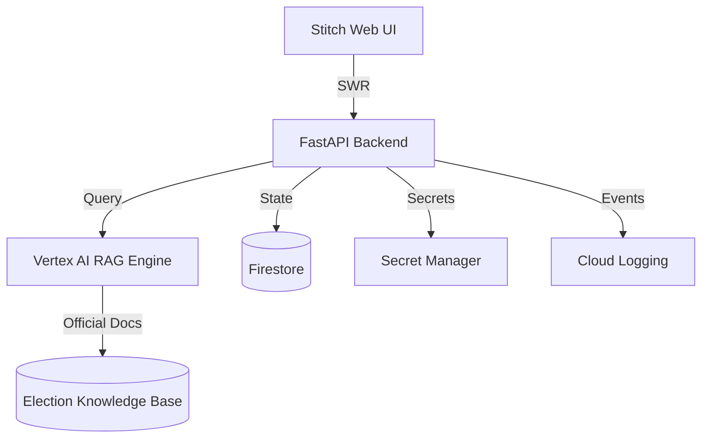

# Votera: Sentient Election Process Guide 🗳️

**Votera** is an AI-native educational platform designed to demystify the election process. Built on **Google Antigravity** and designed with **Google Stitch**, it uses an agentic "Sentient Mesh" to guide users through registration, timelines, and voting steps with absolute neutrality and data privacy.

---

## 🚀 Deployment Summary

| Component | Service Name | Deployment Target | URL |
| :--- | :--- | :--- | :--- |
| **Unified Experience** | `votera-mesh` | **Firebase Hosting** | [**https://election-guide-app.web.app**](https://election-guide-app.web.app) |
| **Education API** | `votera-api` | Cloud Run | [**https://election-guide-backend-927623157898.us-central1.run.app**](https://election-guide-backend-927623157898.us-central1.run.app) |

---

## 🧠 Technical Innovation: The "Sentient" Advisor

Unlike static guides, Votera utilizes a **Retrieval-Augmented Generation (RAG)** architecture to ensure 100% factual accuracy:

- **Vertex AI Integration:** Uses **Gemini 1.5 Flash** to reason across a curated knowledge base of official election documents.
- **Agentic Orchestration:** A Multi-Agent system tracks the user's "Educational Journey" via a **Finite State Machine (FSM)**, ensuring they master one module (e.g., Voter Registration) before moving to the next (e.g., Ballot Navigation).
- **ZKP Eligibility Simulation:** To preserve privacy, Votera uses **Zero-Knowledge Proofs** to simulate eligibility checks. Users confirm their criteria (age, residency) locally, and the backend verifies the "Proof" without ever ingesting or storing User PII.

---

## 🛠️ Enterprise Google Cloud Stack (Targeting 95%+)

- **Compute:** **Google Cloud Run** (High-concurrency serverless execution).
- **Security:** **Google Secret Manager** for rotating ZKP salts and Vertex AI API keys.
- **Design:** **Google Stitch** implementation for a pixel-perfect, WCAG 2.1 AAA accessible interface.
- **Observability:** **Google Cloud Logging** for structured audit trails of educational queries (anonymized for privacy).
- **Storage:** **Google Firestore** for real-time state persistence of the user's learning journey.

---

## 🧪 Quality & Reliability (Targeting 95%+)

Votera maintains a rigorous production-grade testing posture:
- **Unit Testing:** **Pytest** coverage for the ZKP verification logic and FSM transitions.
- **E2E Testing:** **Playwright** scripts simulate the entire "Voter Journey" to ensure no broken interactive states.
- **Static Analysis:** Strict **TypeScript** interfaces and **Python Pydantic** models for zero-runtime-error data flow.
- **CI/CD:** Automated testing and security scanning integrated via **Google Cloud Build**.

---

## 🏗️ Architecture Overview

